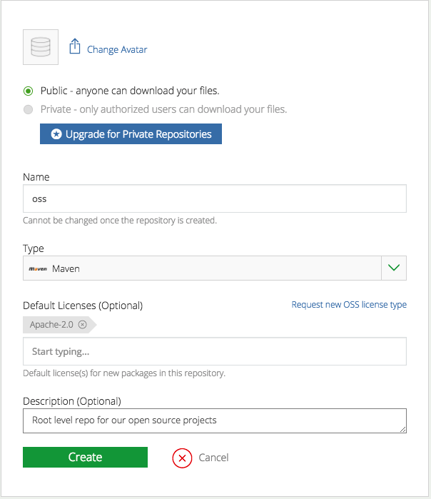
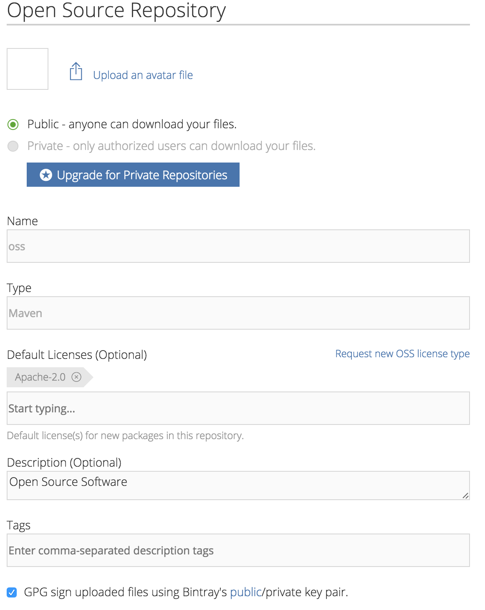
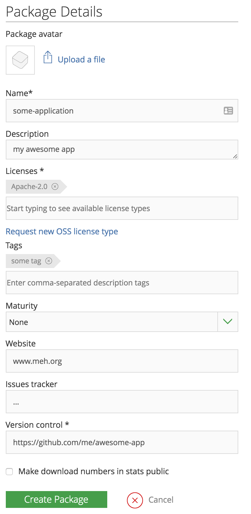

# Publishing Open Source Projects with TravisCI and SBT
Picture the scene: you’ve finished your new shiny open source project but want to publish the artifacts so people can actually use it via maven, sbt, gradle, <insert dependency manager here>.

So, how do we go about this? And more importantly where do we want to publish it?

## Sonatype vs Maven Central vs Bintray
The traditional place to publish `jars`  is  [Maven Central](https://search.maven.org/), pretty much every dependency manager will pull from here, to do this you generally use [OSS Sonatype](http://central.sonatype.org/pages/ossrh-guide.html) which will synchronise with Maven Central. However most (but not all) will now also pull from Bintray, specifically JCenter - which is effectively a like for like replacement for Maven Central - with a much more user friendly (though by no means perfect) interface. SBT Plugins are one example which [favour bintray](http://www.scala-sbt.org/0.13/docs/Bintray-For-Plugins.html).

We’ll come back to this soon, but we also want to talk about snapshots (or any non-final artifact) that we want to publish too.  As [Jan explained previously](http://www.cakesolutions.net/teamblogs/publishing-artefacts-to-oss-sonatype-nexus-using-sbt-and-travis-ci), Sonatype provide a dedicated repository for snapshots. JFrog (The company behind Bintray) have followed suit and provide [JFrog OSS](https://www.jfrog.com/open-source/), which is free for open source projects and integrates nicely with Bintray - we’ll be using this for our snapshots.

Confused? Let’s break this down:
* [OSS Sonatype Nexus](https://oss.sonatype.org/) -> [Maven Central](https://search.maven.org/)
* [JFrog Bintray](https://bintray.com/) -> [JCenter](https://bintray.com/bintray/jcenter)
* Snapshots: [JFrog Bintray](https://bintray.com/) -> [JFrog OSS](https://www.jfrog.com/open-source/)

There’s one more thing - we want our artifacts in **both** Bintray and Maven Central, but don’t want to manually publish to each. Thankfully, Bintray can automatically sync across to Sonatype, which in turn will sync with Maven - which gives us:
* [JFrog Bintray](https://bintray.com/) -> [JCenter](https://bintray.com/bintray/jcenter) ->  [OSS Sonatype Nexus](https://oss.sonatype.org/) -> [Maven Central](https://search.maven.org/)

Phew!

## Let’s get started!
### Sonatype
First off, we need to create a Sonatype account - this requires creating a JIRA account and needs to be manually approved, which is why we do this first. Follow the [OSSRH Guide](http://central.sonatype.org/pages/ossrh-guide.html)
* [ Create your JIRA account](https://issues.sonatype.org/secure/Signup!default.jspa)
* [Create a new Project Ticket](https://issues.sonatype.org/secure/CreateIssue.jspa?issuetype=21&pid=10134)

The ticket should have a `reverse dns` groupId (com.xxx) and a valid unique `Project URL` and `SCM URL` (you can just use the github project address).

### Bintray

#### Create and setup an account
We now need to create our Bintray account, which will eventually sync to Maven via Sonatype. So [Create Your Bintray Account](https://bintray.com/signup/oss)

Immediately  [edit the account](https://bintray.com/profile/edit?tab=Accounts) ,  then under the `Accounts` section add your Sonatype username created previously.

We can now create repositories under which our projects will live. However If this is an organisation, rather than a personal account - you want to first create an organisation and have the repositories live under the organisation. This will allow you to grant multiple users permission to access the repositories.

With that in mind, create a repository at the appropriate level:



Note that the name has no relation to the groupId, a number of projects can live under this repository so it’s more of a way to group projects. Select Maven as the type.

Next, go back to the dashboard (or the organisation), click on the repo then click Edit. check the `GPG sign uploaded files using Bintray’s public/private key pair. This saves us having to create an add our own keys, though you can upload your own GPG key pair to your profile, and have Bintray use that if you prefer.



#### Add a new package
Under your repository, click `Add New Package`. The package is your application.



We must now configure the application to publish to JCenter and JFrog OSS. On the repository screen, click the package.
* On the general tab, click `Add to JCenter`
	* **check “Host my snapshot build artifacts on the OSS Artifactory … ”**
	* Enter the same groupId as used on Sonatype (com.xxxx)
	* This will take a day or two to get approved, once approved you can [login](https://oss.jfrog.org/webapp/#/login) to JFrog OSS using your bintray username and **API Key** (Found under your account settings).
	* **Note**: I’ve previously had issues where they’ve granted incorrect permission on JFrog OSS, causing a `Forbidden` response when trying to publish - if this happens and you’re sure the credentials are correct, it’s worth contacting them for help.

**We need to revisit here to configure the Maven Central tab once we’ve published our first package (it’s disabled until then).**

Before we leave Bintray, take note of your username and API key - we’ll need that later!

### Configure your build.sbt
There are a few things we want to take care of before releasing our project:

#### Licencing
Under what terms can people use our code? Firstly you need to choose a licence (I’d recommend Apache 2.0 or MIT), but we want this automatically adding to our source files. Fortunately there’s an [excellent plugin](https://github.com/sbt/sbt-header) just for this.

Add the plugin to plugins.sbt
```scala
addSbtPlugin("de.heikoseeberger" % "sbt-header"     % "1.8.0")
```

Add the settings to your build.sbt
```scala
.enablePlugins(AutomateHeaderPlugin)
import de.heikoseeberger.sbtheader.license._

lazy val headerSettings =
  Seq(
    headers := Map("scala" -> Apache2_0("2017", "Your Company Here"))
  )
```


#### Versioning
How and in what format do we version the releases? My preference, and what we’ll be implementing here is to automatically release anything merged into master based on git tags, specifically:
* IF the current commit is tagged with "vX.Y.Z" (ie semantic-versioning), the version is "X.Y.Z" and is published to the **release repository**
* ELSE IF the current commit is tagged with "vX.Y.Z-Mx", the version is "X.Y.Z-Mx" and is published to the **snapshot repository**
* ELSE IF the latest found tag is "vX.Y.Z", the version is "X.Y.Z-commitsSinceVersion-gCommitHash-SNAPSHOT" and is published to the **snapshot repository**

We achieve this versioning by first adding [sbt-git](https://github.com/sbt/sbt-git)  plugin to plugins.sbt
```scala
addSbtPlugin("com.typesafe.sbt"  % "sbt-git"        % "0.9.2")
libraryDependencies += "org.slf4j" % "slf4j-nop" % "1.7.25" // Needed by sbt-git
```

Then enabling and configuring it in the build.sbt

```scala
.enablePlugins(AutomateHeaderPlugin, GitVersioning)

val VersionRegex = "v([0-9]+.[0-9]+.[0-9]+)-?(.*)?".r
val MilestoneRegex = "^M[0-9]$".r
lazy val versioningSettings =
  Seq(
    git.baseVersion := "0.0.0",
    git.useGitDescribe := true,
    git.uncommittedSignifier := None,
    git.gitTagToVersionNumber := {
      case VersionRegex(v, "")                      => Some(v) //e.g. 1.0.0
      case VersionRegex(v, s)
        if MilestoneRegex.findFirstIn(s).isDefined  => Some(s"$v-$s") //e.g. 1.0.0-M1
      case VersionRegex(v, "SNAPSHOT")              => Some(s"$v-SNAPSHOT") //e.g. 1.0.0-SNAPSHOT
      case VersionRegex(v, s)                       => Some(s"$v-$s-SNAPSHOT") //e.g. 1.0.0-2-commithash-SNAPSHOT
      case _                                        => None
    }
  )
```

#### Bintray publishing & Pom Info
With versioning taken care of, we still need to configure the build to generate a pom with the required information to be able to publish this to Bintray and subsequently Maven. We’re using `bintray-sbt` for this, note that the version is very deliberate - the later versions in the sbt repository have various niggles for which [issues are open](https://github.com/sbt/sbt-bintray/pull/108).

Add the plugin to plugins.sbt
```scala
addSbtPlugin("me.lessis" % "bintray-sbt" % "0.3.0")
``` 

Create a new publish.sbt file at root level (this will be picked up automatically) to hold our required configuration
```scala

publishTo := {
  if (isSnapshot.value){
    Some("Artifactory Realm" at "http://oss.jfrog.org/artifactory/oss-snapshot-local")
  }
  else {
    publishTo.value
  }
}

credentials ++= List(Path.userHome / ".bintray" / ".artifactory").filter(_.exists).map(Credentials(_)) //For snapshots

organization := "com.myorg"
pomIncludeRepository := { _ => false } //remove optional dependencies from our pom
licenses += ("Apache-2.0", url("https://www.apache.org/licenses/LICENSE-2.0.html"))
homepage := Some(url("http://www.myorg.com"))
scmInfo := Some(ScmInfo(url("https://github.com/myorg/myapp"), "scm:git@github.com:myorg/myapp.git"))
developers := List(Developer("markglh", "Mark Harrison", "markglh@gmail.com", url("https://github.com/markglh")))
publishArtifact in Test := false
bintrayReleaseOnPublish := false //We're releasing via travis, set to true to automatically release on publish instead
publishMavenStyle := true
bintrayRepository := "oss"
bintrayOrganization in bintray := None
```

Above:
* We’re proving all the meta information required to construct a valid pom.
* We’re using the in built `isSnapshot` to determine whether or not to publish to the snapshot or release repository
* We’ve added the additional credentials file required for the snapshot repo (more on this soon!)
* We’ve configured the `bintrayRepository`, which must match out repository in Bintray (surprisingly?)
* We’re not using an organisation, if you are then change the `bintrayOrganization` value accordingly.

### Bintray Credentials
the final step for us to publish artifacts manually is to setup the Bintray credentials locally, create the following two files:

~/.bintray/.credentials
```
realm = Bintray API Realm
host = api.bintray.com
user = BINTRAY USER
password = YOUR BINTRAY API KEY
```

~/.bintray/.artifactory
```
realm = Artifactory Realm
host = oss.jfrog.org
user = BINTRAY USER
password = YOUR BINTRAY API KEY
```

Note that the credentials in each file are the same (form Bintray, NOT from JFrog OSS).

### Publishing Manually
Before we can publish, make sure everything is committed and tag the release: `git tag v0.0.1`.

Running `sbt version` should print our our expected version, `0.0.1`.

To publish manually, simply run the following command:
`sbt publish bintrayRelease`

This will publish to Bintray and make the artifact public (bintrayRelease). For snapshots we don’t need to release as they’re public by default.

#### Sonatype Sync
Using the `bintray-sbt` plugin we can also force a sync to Sonatype (and therefore Maven), however we need to provide the credentials.

You can obtain your Sonatype credentials from [here](https://oss.sonatype.org/#welcome) (user->profile->user token->access user token). This will give you a hashed username and password.

With that, we need to provide the credentials to the `bintraySyncMavenCentral` command, which searches the following places ([in order]( https://github.com/sbt/sbt-bintray/blob/ebbc72a6ce51529a33c85c49713e3714ad030db4/src/main/scala/BintrayRepo.scala#L156))
* Cache
* System properties (sona.user / sona.pass)
* Environment variables (SONA_USER / SONA_PASS)
* User input

Let’s test this, assuming you’ve previously published your artifacts to Bintray.  Run `sbt` then type `bintraySyncMavenCentral`

```
>sbt                                                                                                                                                            ..[myapp]> bintraySyncMavenCentral
Enter sonatype username: somehashedusername
Enter sonatype password: ******************************
...
```

We now have our application published to both Bintray JCenter and Maven Central!

## Automate all the things!!
Whilst we can publish our application, it requires manual steps involving credentials and therefore access to each repository for anyone wanting to release. Let’s automate this using Travis CI.

### Slight Detour to Coveralls and Scalafmt
Before we setup Travis, let’s setup code formatting using [Scalafmt](http://scalameta.org/scalafmt/) and code coverage checks hooked up to the awesome [Coveralls](https://coveralls.io/).

First, Create an account on [Coveralls](https://coveralls.io/) and link it to the github repository.

Now, add the plugins to your plugins.sbt
```
addSbtPlugin("com.geirsson"      % "sbt-scalafmt"   % "0.6.8")
addSbtPlugin("org.scoverage"     % "sbt-scoverage"  % "1.5.0")
addSbtPlugin("org.scoverage"     % "sbt-coveralls"  % "1.1.0")
```

Now, create a file in the root of the project called `.scalafmt.conf`, this will configure the Scalafmt rewriting:
```
style                      = defaultWithAlign
maxColumn                  = 100

project.excludeFilters     = [".*\\.sbt"]
unindentTopLevelOperators  = true
danglingParentheses = true
indentOperator      = spray
align.openParenCallSite = true
align.openParenDefnSite = true
optIn.breakChainOnFirstMethodDot = true
spaces.inImportCurlyBraces = false

project.git = true

// Once upgraded to 0.7
//newlines.beforeImplicitKWInVerticalMultiline=false
//newlines.afterImplicitKWInVerticalMultiline=false
```

We can now format out code by running `sbt scalafmt`, we’ll be taking advantage of this later to automatically fail builds which don’t conform.
Code coverage will be generated and published to Coveralls by running `sbt coverageReport coveralls`

### Travis CI
Back to the main path… create an account for [Travis-CI](https://travis-ci.org/) and link it to your repo, granting the appropriate permissions. With that sorted, we “just” need to configure it to do what we want.

Add the [sbt-travisci](https://github.com/dwijnand/sbt-travisci)  plugin to plugins.sbt
```scala
addSbtPlugin("com.dwijnand"      % "sbt-travisci"   % "1.1.0")
```
This allows sbt to pick up various config options from the travis.yml (such as the Scala versions).

In the root of the project, create `travis.yml`, with the following contents
```YAML
sudo: false
language: scala
scala:
- 2.11.11
- 2.12.2
jdk:
- oraclejdk8
cache:
  directories:
  - "$HOME/.m2/repository"
  - "$HOME/.sbt"
  - "$HOME/.ivy2"
script:
- sbt ++$TRAVIS_SCALA_VERSION clean coverage scalafmtTest test
# Tagged releases
- if [ $TRAVIS_TEST_RESULT -eq 0 -a "$TRAVIS_PULL_REQUEST" = "false" ] && [[ "$TRAVIS_TAG"
  =~ ^v[0-9]+\.[0-9]+(\.[0-9]+)?(-M[0-9]+)?$ ]]; then echo "** Publishing Release
  $TRAVIS_TAG **" && tar xf secrets.tar && mkdir ~/.bintray && cp publishing/.credentials
  ~/.bintray/ && sbt ++$TRAVIS_SCALA_VERSION publish bintrayRelease bintraySyncMavenCentral;
  fi
# Snapshots (anything merged into master)
- if [ $TRAVIS_TEST_RESULT -eq 0 -a "$TRAVIS_PULL_REQUEST" = "false" -a "$TRAVIS_BRANCH"
  = "master" ]; then echo "** Publishing Snapshot from master **" && tar xf secrets.tar
  && mkdir ~/.bintray && cp publishing/.credentials ~/.bintray/ && cp publishing/.artifactory
  ~/.bintray/ && sbt ++$TRAVIS_SCALA_VERSION publish; fi
after_success:
- sbt ++$TRAVIS_SCALA_VERSION coverageReport coveralls
before_cache:
- find $HOME/.ivy2/cache -name "ivydata-*.properties" -print -delete
- find $HOME/.sbt        -name "*.lock"               -print -delete

```

Ok, so there’s a LOT going on here, let’s walk through the important parts.
* We’re defining both Scala 2.11 and Scala 2.12, so Travis will create two separate (sub)builds.
* We’re `caching` directories to speed up builds (sudo must be false for this to work - that enables the Dockerized Travis)
* The commands in the `script` section run sequentially, if one returns a non-zero exit code, then the build is marked as a failure - but the subsequent commands will still execute. We take advantage of this by using conditionals (which still return a zero exit code if the condition doesn’t match).
	* The first command runs a standard build, with code coverage. It also validates the code formatting, failing the build if the code doesn’t conform.
	* We then have two more commands, which will ONLY run on the master branch or a matching tag according to a regex. We treat all builds on the master branch as `snapshot` releases. Once these are tagged with an appropriate version, a build will be kicked off which publishes, releases and syncs the artifact to Sonatype.
* `after_success` runs on a successful build, but cannot fail the build. This is why we perform our release publishing in the `script` section, we want it to fail the build is it doesn’t complete successfully.

#### Travis Authentication
We’re almost there! But right now Travis doesn’t have permission to publish to Bintray or Sonatype. To solve this, we need to perform a two steps:
* [`tar` and encrypt](https://docs.travis-ci.com/user/encrypting-files/) the two Bintray credential files, to be extracted in Travis.
* [Encrypt the Sonatype credentials](https://docs.travis-ci.com/user/encryption-keys/) as environment variables in Travis.

Let’s walk through this step by step
1. Install the Travis CLI tool: `gem install travis`
2. Login to travis: `travis login --github-token xxxx` - create a github token [here](https://github.com/settings/tokens)
3. Encrypt the bintray credential files (.credentials, .artifactory), From the repository root dir:
	* Copy the credential files into the publishing directory
		* `mkdir publishing`
		* `cp ~/.bintray/.credentials ./publishing && cp ~/.bintray/.artifactory ./publishing`
	* tar the files: `tar cvf secrets.tar publishing/.credentials publishing/.artifactory`
	* verify the contents: `tar tvf secrets.tar` 
	* encrypt the tar (—add will automatically update travis.yml instead of just printing out the values)
		* `travis encrypt-file secrets.tar --add` 
	* **Remove the unencrypted tar, .credentials and .artifactory files**
		* `rm secrets.tar && rm publishing/.artifactory && rm publishing/.credentials`
	* Add `secrets.tar`, `.credentials` & `.publishing` to the `.gitignore`, to be safe - you really do not want to accidentally publish the unencrypted secrets!!
4. Encrypt the Sonatype Nexus API Key credentials as env vars
	* As described previously, when running `bintraySyncMavenCentral` the credentials can be specified in a number of ways. In Travis we’re going to specify them as environment variables. Travis will automatically decrypt the keys and set the vars
	* `travis encrypt SONA_USER=xxxx --add`
	* `travis encrypt SONA_PASS=xxxxx --add`

You’ll now see two new sections in the `travis.yml` file, `env` and `before_install`. Travis will automatically run these steps as part of the build. Notice in the `script` section that we expect the `.artifactory` and `.credentials` to be present, then copy them into the Travis home directory from `.publishing`

## Finishing off
That’s it! We can now test our new setup. Commit the code and push it up to github. A build should be kicked off, publishing a snapshot to the [JFrog OSS](https://www.jfrog.com/open-source/) artifactory. If the build fails, make sure you’ve formatted the code locally first, you can do this by running `sbt scalafmt`.

Once everything is happy, create a release in github. Let’s go with `v0.0.2` as the new version, Travis should pick up the tag and kick off a new build. Sit tight, if all goes well you should find the artifacts for both scala versions in all the expected places:
* [JFrog Bintray](https://bintray.com/)
* [JCenter](https://bintray.com/bintray/jcenter) 
* [OSS Sonatype Nexus](https://oss.sonatype.org/) 
* [Maven Central](https://search.maven.org/)

It can take some time to propagate all the way to Maven (I’ve seen it take hours). You can login to Bintray, navigate to the package and view the `Maven Central` tab to view when the last sync to Sonatype occurred.

## Phew!!
We achieved a lot, out shiny new application has automatic code formatting, code coverage published to Coveralls, automatic versioning and automatic releasing (everywhere!) of both final, milestone and snapshot versions, based on tags - not to mention automated compilation and testing of pull requests prior to merging. Enjoy!!

## References
* [Painless release with SBT - Byjean](http://blog.byjean.eu/2015/07/10/painless-release-with-sbt.html)
* [Publishing artefacts to OSS Sonatype Nexus using SBT and Travis CI Here…](http://www.cakesolutions.net/teamblogs/publishing-artefacts-to-oss-sonatype-nexus-using-sbt-and-travis-ci)
* [Automatic deployments to JFrog OSS and Bintray/jCenter/Maven Central via Travis CI from SBT – Szimano’s Blog](http://szimano.org/automatic-deployments-to-jfrog-oss-and-bintrayjcentermaven-central-via-travis-ci-from-sbt/)
* https://www.jfrog.com/confluence/display/RTF/Deploying+Snapshots+to+oss.jfrog.org
* [Enjoy Bintray and use it as pain-free gateway to Maven Central | Blog @Bintray](https://blog.bintray.com/2014/02/11/bintray-as-pain-free-gateway-to-maven-central/)
* https://bintray.com/docs/usermanual/uploads/uploads_syncingwiththirdpartyplatforms.html#_syncing_artifacts_with_maven_central
* https://docs.travis-ci.com/user/encrypting-files/
